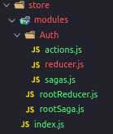
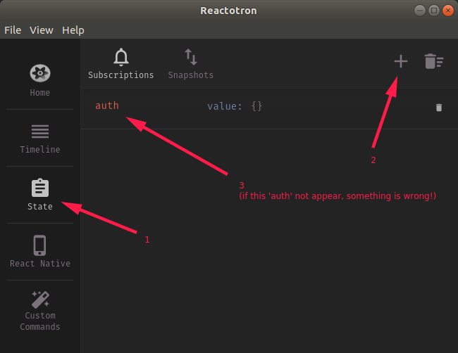
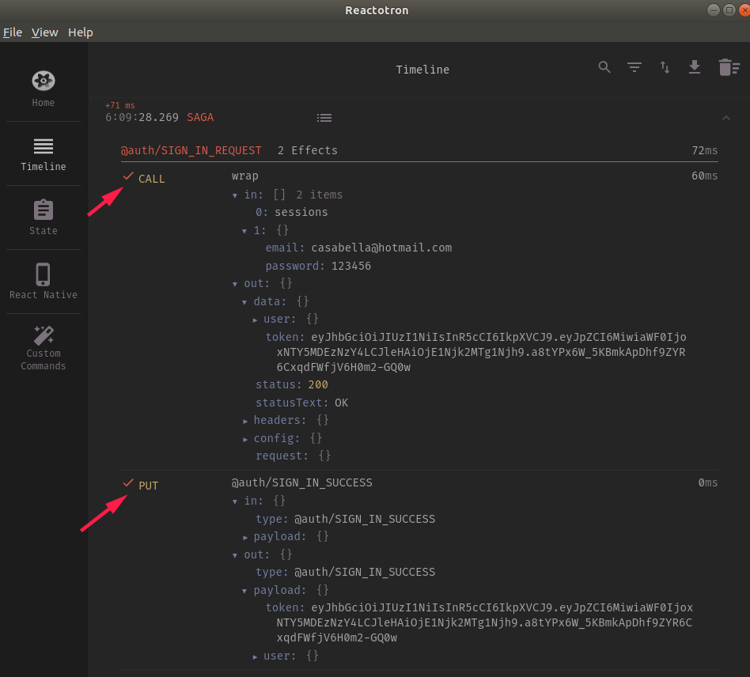
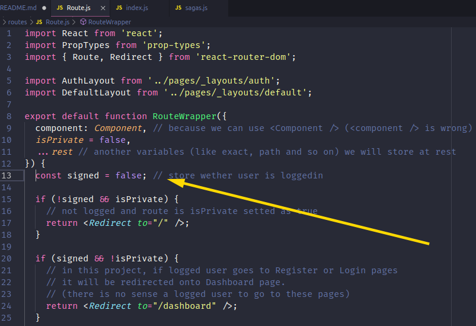
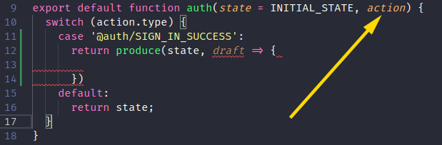
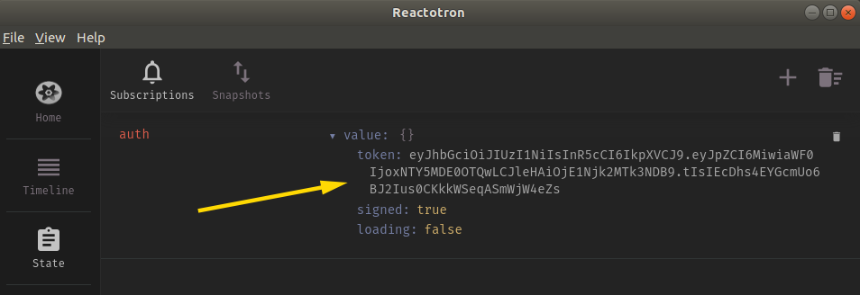
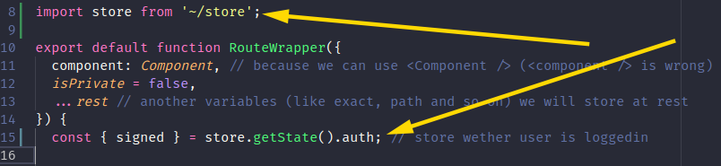

# Extras about routes

### Protecting Routes

How could we protect specific pages, like Dashboard and Profile?

1. Create [/src/routes/Route.js](./src/routes/Route.js) (open this file for further details).
2. Add `isPrivate` at the routes we want to protect (accessed by a authenticated user only) within [/src/Routes/index.js])(./src/Routes/index.js):

```javascript
<Route path="/dashboard" component={Dashboard} isPrivate />
```

3. Remove _Route_ importation from _react-router-dom_ and import _/src/routes/Route.js_ into [/src/routes/index.js](./src/routes/index.js).

```javascript
import { Switch } from 'react-router-dom';
import Route from './Route';
```

Now every route which has `isPrivate` will be protected.

NOTE that we created a kind of middleware in Routes, intercepting with a custom `<Route>` in order to implement protected routes.

### Creating custom 404 page

At [/src/routes/index.js](./src/routes/index.js) we will add a new route (latest one):

```javascript
<Switch>
  // another routes
  <Route path="/" component={() => <h1>404</h1>} />
  // It could be a component as a file
</Switch>
```

# Using root import

Every time we want to call some file in our scripts, like:

```javascript
import SignIn from '../pages/Signin';
import SignUp from '../pages/Signup';

import Dashboard from '../pages/Dashboard';
import Profile from '../pages/Profile';
```

We must indicate `../.../../../` 😓 every time! And it is very boring to do that!

However, if we want to simplify this process making it less boring, we need to install an extra plugin from Babel (remembering that Babel transpiles our code in a manner that the browsers understand). But we know that a project created through `yarn create react-app`, Babel and Webpack's configurations are encapsuled in their packages (we do not have an easily access in its configurations). we need to install two libs which allow us to configure in our manner these settings within a project created by `creat react-app`:

`$ yarn add customize-cra react-app-rewired babel-plugin-root-import -D`

Create [./config-overrides.js](./config-overrides.js). This file will be loaded by `react-app-rewired` and we can set any configurations. Please open it to see the configurations.

Now, `~/` represents `/src/` and we can call files like this:

```javascript
import SignIn from '~/pages/Signin';
import SignUp from '~/pages/Signup';

import Dashboard from '~/pages/Dashboard';
import Profile from '~/pages/Profile';
```

Then, open [./package.json](./package.json) and change the scripts by:

```javascript
"scripts": {
  "start": "react-app-rewired start",
  "build": "react-app-rewired build",
  "test": "react-app-rewired test",
  "eject": "react-scripts eject"
},
```

However ESLint will not understand this `~` and will warn this callings as errors. 🤔
To solve this, install:
`$ yarn add eslint-import-resolver-babel-plugin-root-import -D`

Open [./.eslintrc.js](./.eslintrc.js) and add this configuration under `rules` configs:

```javascript
rules: { ... },
settings: {
  "import/resolver": {
    "babel-plugin-root-import": {
      rootPathSuffix: "src"
  }
}}
```

It's done! ESlint now may understand `~/` importings.

Wait! There is a last configuration we should make! 😒

If you try to open `'~/pages/Signin'` with <kbd>CTRL</kbd>+<kbd>Right-click</kbd>, VSCode will not open this file automatically. To solve it create [./jsconfig.json](./jsconfig.json). Open this file for further details.

# Using Unform

By default, if we want to get the inputs values (from authentication and registration) we should create states monitoring every changes in these inputs by `onChange` storing them into a state variable, and get these variables submiting to API.

We have a lib which create performatic forms which we can use in our ReactJS projects:

`$ yarn add @rocketseat/unform`

1. Import it within [SignIn page](./src/pages/Signin/index.js)

```javascript
import { Form, Input } from '@rocketseat/unform';
```

2. Replace `<form>` into `<Form>` and `<input>` into `<Input>`;
3. Add in each `<Input>` a `name`;
4. Add `<Form onSubmit={handleSubmit}>` and include a new function:

```javascript
function handleSubmit(data) {
  console.tron.log(data);
}
```

5. Try it submitting something and you will see each input along with its value.

# Validating

Let's implement validation which it will prevent the user to submit form with invalid inputs.

Install: `$ yarn add yup`
(Yes! this Yup we've implemented in our GoBarber's backend 👍! [Click here to remember](https://github.com/rodrigotamura/go-stack-2019/tree/master/module02#validation) and go back here again!)

Please, open [Signin page](.src/pages/Signin/index.js) and [Signup page](./src/pages/Signun/index.js) to see the implementations.

Now, trying validation you will see the error messages:


We could apply some stylization on these error messages [here](./src/pages/_layouts/auth/styles.js).

As long as there ae errors in the validation, the form will not submit.

# Configuring Store

The authentication we will make using Redux, because the JWT token must be available in whole application. It includes also the user's informations which we will use them on many components, e.g. Header component which indicates who is logged in.

### Adding Redux, Saga, Immer and its features

For a deeper understanding about it, [click here](https://github.com/rodrigotamura/go-stack-2019/tree/master/module04/flux#configuring-redux).

However in a nutshell we'll explain again about Redux and Saga implementations:

1. Install `$ yarn add redux redux-saga react-redux reactotron-redux reactotron-redux-saga immer`
2. Create these folders and files under `/src/`:



3. Coding [reducer](./src/store/modules/auth/reducer.js);
4. Coding [actions](./src/store/modules/auth/actions.js);
5. Coding [sagas](./src/store/modules/auth/sagas.js);
6. Coding [rootReducer](./src/store/modules/rootReducer.js);
7. Coding [rootSaga](./src/store/modules/rootSaga.js);
8. Coding [Redux configuration](./src/store/index.js);

   8.1 We will create [/src/store/createStore.js](./src/store/createStore.js) in order to not make so big the [Redux configuration](./src/store/index.js);

9. Configuring [Reactotron config](./src/config/ReactotronConfig.js) for Redux recognition;

   9.1 Open [Redux configuration](./src/store/index.js);
   9.2 Open [/src/store/createStore.js](./src/store/createStore.js);

10. Open [App.js](./src/App.js)
11. Test it, openning Reactotron Destop, and adding a new _state_ called `auth`:



# Implementing Authentication

1. Create functions `signInRequest()`, `signInSuccess()` and `signFailure()` in [actions](./src/store/modules/auth/actions.js);
2. Open [sagas](./src/store/modules/auth/sagas.js) and code `signIn()` function;
3. Open [Signin page](.src/pages/Signin/index.js) and implement React Hooks (`useDispatch`), and import `signInRequest()` from `/src/store/modules/auth/actions.js` which SignIn component need to fire in order to Saga listen on it and make the authentication process;

Now, if you try to sign in again with correct e-mail and password, Reactotron DEsktop will show us:



Note that `CALL` (calling API) is returning successfully the JWT token, and `PUT` is sending `token` and `user` with its values into `@auth/SIGN_IN_SUCCESS`.

We need now to make the variable `signed` within [Route](src/routes/Route.js) receives dynamically wether user is logged in or not:



To make it, we need firstly open [reducer](./src/store/modules/auth/reducer.js) and set the `INITIAL_STATE` and add a new behavior when the action `@auth/SIGN_IN_SUCCESS` is fired. Remembering that our token and user's informations retrieved from API are stored in `payload` object within`action`:



If you try to login again, Reactotron will show us that **auth reducer** has the follow data:



Open [Route](src/routes/Route.js) and import Redux configurations and `signed` variable will receive the Redux's state:


